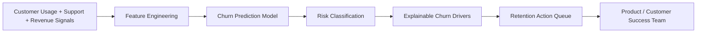

# 📉 ChurnGuard

**ChurnGuard** is an AI-powered customer retention intelligence dashboard that predicts churn risk, explains why customers may leave, and helps product and customer success teams prioritize high-impact retention actions.

🔗 **Live Demo:** Add your Streamlit link here

---

## 🚀 Project Overview

Customer churn is one of the biggest risks for SaaS and enterprise platform companies. Product and customer success teams often have access to usage, support, revenue, and satisfaction data, but these signals are usually scattered across multiple systems.

ChurnGuard combines these signals into one decision-support product that identifies at-risk customers, explains churn drivers, and quantifies revenue at risk.

---

## 🎯 Target Users

- Product managers
- Customer success managers
- Product analysts
- Revenue operations teams
- Growth teams
- Executives responsible for retention

---

## ✨ Key Features

- Predicts customer churn probability using machine learning
- Classifies customers into Low, Medium, and High churn risk
- Explains churn drivers in plain language
- Calculates revenue at risk
- Prioritizes high-value customers for retention outreach
- Visualizes churn risk by customer segment, plan, and product usage

---

## 🧠 Product Thinking

ChurnGuard is designed to help teams move from reactive support to proactive retention.

### User Problem
Teams often know customers are disengaging, but they lack a clear way to identify who is most likely to churn and why.

### Product Solution
ChurnGuard predicts churn risk, explains behavioral drivers, and helps teams prioritize retention actions based on revenue impact.

### Success Metrics
- Reduction in churn rate
- Increase in retention saves
- Revenue protected
- Time to identify high-risk accounts
- Feature adoption lift among at-risk customers

---

## 🛠️ Tech Stack

- Python
- Streamlit
- Pandas
- NumPy
- Scikit-learn
- Plotly

---

## 🏗️ Architecture



---

## 📸 Screenshots

Add screenshots here:

```md


```

---

## 💼 Resume Bullet

Built and deployed ChurnGuard, an AI-powered customer retention intelligence dashboard using Python, Streamlit, Scikit-learn, and Plotly to predict churn risk, explain customer behavior drivers, and prioritize retention actions based on revenue impact.

---

## 🔮 Future Roadmap

- Add recommended retention playbooks
- Add customer health score history
- Add CRM integrations such as Salesforce
- Add workflow triggers for ServiceNow or Jira
- Add automated alerts for high-value customers